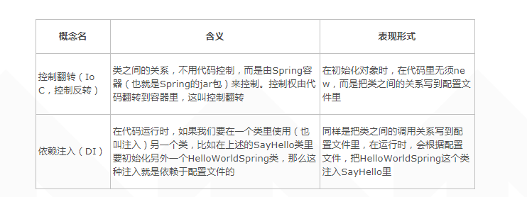
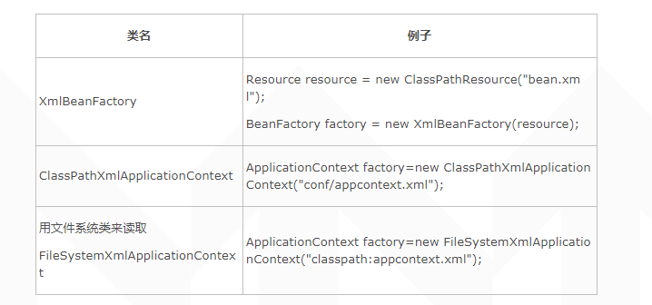
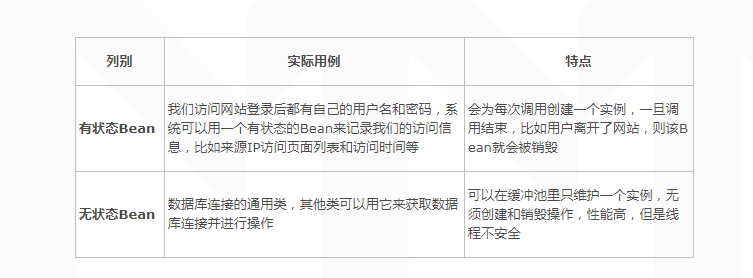

### Spring 依赖注入DI（IOC）

```
package com;
import org.springframework.context.ApplicationContext;
import org.springframework.context.support.ClassPathXmlApplicationContext;
public class SpringMain {
    public static void main(String[] args) {
        ApplicationContext context = new ClassPathXmlApplicationContext(
                "conf/applicationContext-*.xml");

    SayHello sayHello = (SayHello) context.getBean("SayHello");
    sayHello.sayHello();        
    }
}

applicationContext-service-api.xml:

<bean id="HelloWorldSpring" class="com.HelloWorldSpring">
</bean>
<bean id="SayHello" class="com.SayHello" >
<property name="helloWorldSpring" ref="HelloWorldSpring" />
</bean>
```
 IoC的特点，不用New就可以初始化类

运行SpringMain.java时，首先是把配置文件里定义的信息装载到context类里；接着在第2行里，通过context.getBean方法，根据配置文件的定义，获取ID为SayHello（即class是com.SayHello）这个类；随后在第3行里使用这个类的sayHello方法。从代码中大家可以看出，这里同样没有用到new，而是根据配置文件来初始化类。

 没有使用new，就意味着低耦合，具体而言，就是SayHello、HelloWorldSpring和SpringMain这三个类之间的耦合度很低。

##### 控制翻转IoC（Inversion of Control）和依赖注入DI（Dependency Injection）

 通过上面的描述，能看到它们其实是从不同的角度讲述的同一件事情。依赖注入强调类的注入是由Spring容器在运行时完成，而控制反转强调类之间的关系是由Spring容器控制。

       从这两个名词可知， Spring给我们带来了一种全新的编程理念，即不用new也可以创建和使用对象。这种开发方式让我们能像搭积木一样组装不同的类，组装后的类之间的耦合度很低，一个类的修改可以不影响（或者影响度很小）其他的类，这样就可以避免一个小修改带来的一大串连锁反应。

       大家在了解Spring的时候，一定请理解“低耦合”这个好处，这本来是面向对象思想带给我们的好处，在Spring开发的过程中我们确实能感受到。
##### 读取配置文件的各种方式

在Spring里，通常在配置文件中描述各类以及类之间的包含关系，在使用的时候，会先加载配置文件，Spring的内核会读取配置文件，随后动态地组装各类。

       通过下表来总结一下读取配置文件的各种方式，它们之间没有优劣之分，大家可以挑选个最适用的，具体来讲，没有特殊情况，就可以用ClassPathXmlApplicationContext。


##### 单例和多例
```
<bean id="SayHello" class="com.SayHello" singleton="false"> 或者
<bean id="SayHello" class="com.SayHello" scope="prototype">
```
在实际项目中，一般用单例模式来创建无状态的Bean，而对于有状态的Bean，一般不用这种模式。所谓无状态的Bean，是指没有能够标识它目前状态属性的Bean，比如共享单车，A用好以后，可以放入共享池（即放到马路边上），B可以继续使用。由于没有供某个特定的用户使用，所以也就不能保持某一用户的状态，所以叫无状态Bean。相反，如果针对个人的自行车，那么会有个状态来表明是个人的。

      讲到这里，请大家确认如下概念，并不是我们首先设置了singleton是false，所以Spring容器才用单例的方式，恰恰相反，根据实际的需求，待创建的类可以被其他多个类共享，因此我们才设置singleton是false。是先有需求再有具体的实现。


### 面向切面（AOP），


### 和数据库的整合（比如和Hibernate整合或声明式事务等）以及Spring MVC架构