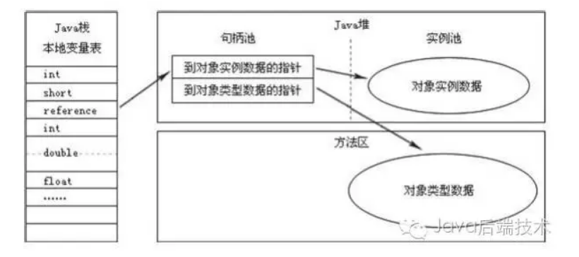
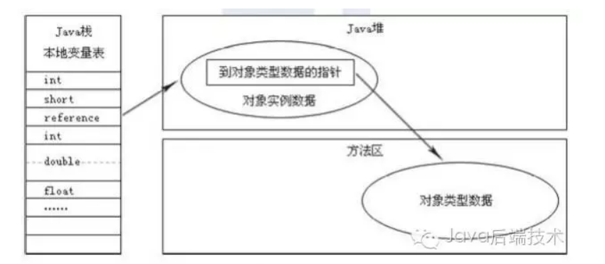

### 1. 概述
    JVM相当于Java的操作系统;
    JVM,java virtual machine, 即Java虚拟机，是运行java class文件的程序。
    Java代码经过Java编译器编译，会编译成class文件，一种平台无关的代码格式，class文件按照JVM规范，包括了java代码运行所需的元数据和代码等内容。JVM加载class文件后，就可以执行java代码了。
    Java代码 > class文件 > JVM规范 > JVM实现的层次

### 2. Java运行时数据区域 

    运行时数据区：
    
    1. 线程隔离的数据区
        程序计数器（Program Counter Register）
            JVM也有自己的CPU，在执行多线程程序的时候，通过时间片轮转的方式，根据程序计数器来调
            度线程的执行。 
            是一块较小的内存空间，它的作用可以看做是当前线程所执行的字节码的行号指示器。
            Java 虚拟机的多线程是通过线程轮流切换并分配处理器执行时间的方式来实现的，在任何一个确定的时刻，一个处理器（对于多核处理器来说是一个内核）只会执行一条线程中的指令。
            为了线程切换后能恢复到正确的执行位置，每条线程都需要有一个独立的程序计数器，各条线程之间的计数器互不影响，独立存储，我们称这类内存区域为“线程私有”的内存。

            如果线程正在执行的是一个 Java 方法，这个计数器记录的是正在执行的虚拟机字节码指令的地址；如果正在执行的是 Natvie 方法，这个计数器值则为空（ Undefined）。此内存区域是唯一一个在Java 虚拟机规范中没有规定任何 OutOfMemoryError 情况的区域。

        虚拟机栈（VM Stack）
            是线程私有的，它的生命周期与线程相同。 
            每个方法被执行的时候都会同时创建一个栈帧（ Stack Frame①）用于存储局部变量表、操作栈、动态链接、方法出口等信息。每一个方法被调用直至执行完成的过程，就对应着一个栈帧在虚拟机栈中从入栈到出栈的过程。
            局部变量表存放了编译期可知的各种基本数据类型（ boolean、 byte、 char、 short、 int、 float、long、 double）、对象引用（ reference 类型，它不等同于对象本身，根据不同的虚拟机实现，它可能是一个指向对象起始地址的引用指针，也可能指向一个代表对象的句柄或者其他与此对象相关的位置）和 returnAddress 类型（指向了一条字节码指令的地址）。
            其中 64 位长度的 long 和 double 类型的数据会占用 2 个局部变量空间（Slot），其余的数据类型只占用 1 个。局部变量表所需的内存空间在编译期间完成分配，当进入一个方法时，这个方法需要在帧中分配多大的局部变量空间是完全确定的，在方法运行期间不会改变局部变量表的大小。

            在 Java 虚拟机规范中，对这个区域规定了两种异常状况：如果线程请求的栈深度大于虚拟机所允许的深度，将抛出 StackOverflowError 异常；如果虚拟机栈可以动态扩展（当前大部分的 Java 虚拟机都可动态扩展，只不过 Java 虚拟机规范中也允许固定长度的虚拟机栈），当扩展时无法申请到足够的内存时会抛出 OutOfMemoryError 异常。

        本地方法栈（Native Method Stack）
            与虚拟机栈所发挥的作用是非常相似的，其区别不过是虚拟机栈为虚拟机执行 Java 方法（也就是字节码）服务，而本地方法栈则是为虚拟机使用到的 Native方法服务。虚拟机规范中对本地方法栈中的方法使用的语言、使用方式与数据结构并没有强制规定，因此具体的虚拟机可以自由实现它。甚至有的虚拟机（譬如 Sun HotSpot 虚拟机）直接就把本地方法栈和虚拟机栈合二为一。与虚拟机栈一样，本地方法栈区域也会抛出StackOverflowError 和OutOfMemoryError 异常。

    2. 由所有线程共享的数据区
        堆（Heap）
            是 Java 虚拟机所管理的内存中最大的一块。 Java堆是被所有线程共享的一块内存区域，在
            虚拟机启动时创建。
            唯一目的就是存放对象实例，几乎所有的对象实例都在这里分配内存。这一点在 Java 虚拟机规范中的描述是：所有的对象实例以及数组都要在堆上分配，但是随着 JIT 编译器的发展与逃逸分析技术的逐渐成熟，栈上分配、标量替换优化技术将会导致一些微妙的变化发生，所有的对象都分配在堆上也渐渐变得不是那么“绝对”了。
            根据 Java 虚拟机规范的规定， Java 堆可以处于物理上不连续的内存空间中，只要逻辑上是连续的即可，就像我们的磁盘空间一样。在实现时，既可以实现成固定大小的，也可以是可扩展的，不过当前主流的虚拟机都是按照可扩展来实现的（通过-Xmx 和-Xms 控制）。如果在堆中没有内存完成实例分配，并且堆也无法再扩展时，将会抛出 OutOfMemoryError 异常。

        方法区（Method Area）
            与 Java 堆一样，是各个线程共享的内存区域，它用于存储已被虚拟机加载的类信息、常量、静态变量、即时编译器编译后的代码等数据。虽然 Java 虚拟机规范把方法区描述为堆的一个逻辑部分，但是它却有一个别名叫做 Non-Heap（非堆），目的应该是与 Java 堆区分开来。
            除了和 Java 堆一样不需要连续的内存和可以选择固定大小或者可扩展外，还可以选择不实现垃圾收集。
            这个区域的内存回收目标主要是针对常量池的回收和对类型的卸载，一般来说这个区域的回收“成绩”比较难以令人满意，尤其是类型的卸载，条件相当苛刻，但是这部分区域的回收确实是有必要的。
            根据 Java 虚拟机规范的规定，当方法区无法满足内存分配需求时，将抛出 OutOfMemoryError 异常。

            运行时常量池（ Runtime Constant Pool）是方法区的一部分;具备动态性-
            Class文件常量池-用于存放编译期生成的各种字面量和符号引用，这部分内容将在类加载后存放到方法区的运行时常量池中。

直接内存（ Direct Memory）并不是虚拟机运行时数据区的一部分，也不是 Java 虚拟机规范中定义的内存区域，但是这部分内存也被频繁地使用，而且也可能导致 OutOfMemoryError 异常出现。

本机直接内存的分配不会受到 Java 堆大小的限制，但是，既然是内存，则肯定还是会受到本机总内存（包括 RAM 及 SWAP 区或者分页文件）的大小及处理器寻址空间的限制。服务器管理员配置虚拟机参数时，一般会根据实际内存设置-Xmx 等参数信息，但经常会忽略掉直接内存，使得各个内存区域的总和大于物理内存限制（包括物理上的和操作系统级的限制），从而导致动态扩展时 出现 OutOfMemoryError 异常。
        
### 3. 值对象访问以及如何使用对象的引用
    最简单的访问，也会却涉及 Java 栈、 Java 堆、方法区
    另外，在 Java 堆中还必须包含能查找到此对象类型数据（如对象类型、父类、 实现的接口、方法等）的地址信息，这些类型数据则存储在方法区中。

    （1）使用句柄
     Java 堆中将会划分出一块内存来作为句柄池，reference 中存储的就是对象的句柄地址，而句柄中包含了对象实例数据和类型数据各自的具体地址信息

    
    （2）直接指针
    Java 堆对象的布局中就必须考虑如何放置访问类型数据的相关信息， reference 中直接存储的就是对象地址

这两种对象的访问方式各有优势，使用句柄访问方式的最大好处就是 reference 中存储的是稳定的句柄地址，在对象被移动（垃圾收集时移动对象是非常普遍的行为）时只会改变句柄中的实例数据指针，而 reference 本身不需要被修改。

使用直接指针访问方式的最大好处就是速度更快，它节省了一次指针定位的时间开销，由于对象的访问在 Java 中非常频繁，因此这类开销积少成多后也是一项非常可观的执行成本。

