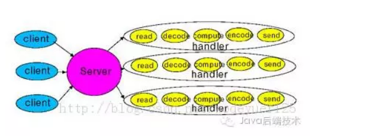
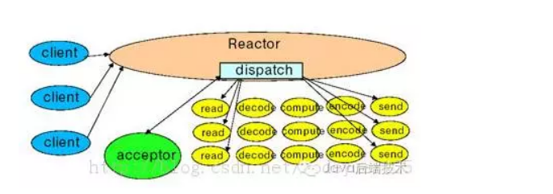
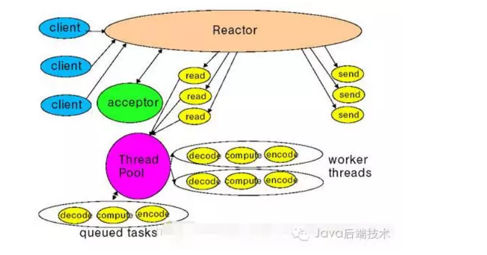

### 1. 同步异步指的是通信模式，而阻塞和非阻塞指的是在接收和发送时是否等待动作完成才返回所以不能混淆这四个词。

    首先是通信的同步，主要是指客户端在发送请求后，必须得在服务端有回应后才发送下一个请求。所以这个时候的所有请求将会在服务端得到同步
    
    其次是通信的异步，指客户端在发送请求后，不必等待服务端的回应就可以发送下一个请求，这样对于所有的请求动作来说将会在服务端得到异步，这条请求的链路就象是一个请求队列，所有的动作在这里不会得到同步的。

    阻塞和非阻塞只是应用在请求的读取和发送。 

    在实现过程中，如果服务端是异步的话，客户端也是异步的话，通信效率会很高，但如果服务端在请求的返回时也是返回给请求的链路时，客户端是可以同步的，这种情况下，服务端是兼容同步和异步的。相反，如果客户端是异步而服务端是同步的也不会有问题，只是处理效率低了些。

    同步=阻塞式，异步=非阻塞式 ；
    同步和异步都只针对于本机SOCKET而言的 ；

    同步模式下，比如RECIEV和SEND，都要确保收到或发送完才返回，继续执行下面的代码不然就阻塞在哪里，所以，同步模式下，一般要用到线程来处理。
    异步模式就不同了，不管有没有收到或发送出去，他都马上返回，继续执行下面的代码，结果由消息通知。

### OIO中，
    每个线程只能处理一个channel（同步的，该线程和该channel绑定）。 
    线程发起IO请求，不管内核是否准备好IO操作，从发起请求起，线程一直阻塞，直到操作完成,如图
    

### NIO中，
    每个线程可以处理多个channel（异步）。

    线程发起IO请求，立即返回；内核在做好IO操作的准备之后，通过调用注册的回调函数通知线程做IO操作，线程开始阻塞，直到操作完成 

### AIO中，
    线程发起IO请求，立即返回；内存做好IO操作的准备之后，做IO操作，直到操作完成或者失败，通过调用注册的回调函数通知线程做IO操作完成或者失败 

那么OIO如何处理海量连接请求呢？ 

    是对每个请求封装成一个request，然后从线程池中挑一个worker线程专门为此请求服务，如果线程池中的线程用完了，就对请求进行排队。请求中如果有读写数据，是会阻塞线程的。

2、NIO中channel肯定是非阻塞模式的，否则抛出异常。为什么呢？因为前面selector异步通知程序的时候，通道中的数据肯定是有的。

3、同步与阻塞是不同的概念，异步与非阻塞也是不同的概念。

4、阻塞式iO会浪费大量的cup进行无意义的上下文切换，因为还是可能读/写不到任何数据。

5、同步阻塞：通常给人的印象。把通知应用程序和读/写消息结合在了一起，因为有了数据才能通知；

同步非阻塞：

异步阻塞：

异步非阻塞：通常给人的印象。因为如果是异步通知的话，肯定是能拿到数据的。有效减少线程切换。目前Java的nio的异步看起来是阻塞的，因为阻塞在select.select()操作上了。但是其实可以通过select.wakeUp()方法，不用一直阻塞。但要想获得通道状态，还是必须等待select.select返回才行的。

综上所述，同步和阻塞给人的概念是一样的。而异步和非阻塞跟给人的概念是一样的。