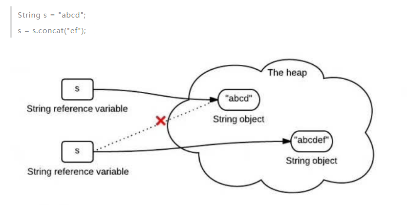

1. 如何高效判断数组中是否包含某个元素

    使用ArrayUtils工具类或 使用一个简单的循环方法

2. 字符串不变性

3. equals()方法、hashCode()方法的区别
    
    HashCode被设计用来提高性能。equals()方法与hashCode()方法的区别在于：
    
        如果两个对象相等(equal)，那么他们一定有相同的哈希值。
        如果两个对象的哈希值相同，但他们未必相等(equal)。

4. Java异常类的层次结构
图中红色部分为受检查异常。它们必须被捕获，或者在函数中声明为抛出该异常。

5. Collection接口是集合类的根接口
   
    Set中不能包含重复的元素，也没有顺序来存放。
    而List是一个有序的集合，可以包含重复的元素。

    而Map又是另一个接口，它和Collection接口没有关系。Map包含了key-value键值对，同一个Map里key是不能重复的，而不同key的value是可以相同的。

    TreeSet 、TreeMap 有序

6. ArrayList

    首先ArrayList内部是由数组来实现的。而且在存放数据的数组长度不够时，会进行扩容，即增加数组长度。在Java 8中是默认扩展为原来的1.5倍。

    既然是数组，那么优点就是查找某个元素很快。可以通过下标查找元素，查找效率高。但是由此也看出缺点，每次删除元素，都会进行大量的数组元素移动，复制新的数组等等。增加元素的话如果长度不够，还要进行扩容。因此删除效率低。如果我们在实际开发中能够清楚知道我们的数据量，建议创建ArrayList的时候指定长度，这样无需频繁增加数据时不断进行扩容。

7. LinkedList

    内部就是由链表的形式实现。它并没有用数组来存储数据元素

    首先LinkedList内部是由双向链表来实现的。我们储存的每一个数据都会被封装在一个数据结点之中。而结点疯转了指向前结点的指针，数据，指向后结点的指针。依靠这些数据结点实现双向链表。
    既然是链表，那么优点就是添加，插入，删除数据效率比数组高很多。因为在插入或者删除某个数据时，只需对要删除结点，前结点，后结点进行操作，无需像数组一样将后续数据全部前移或者后移。但是由此也看出缺点，因为链表并不是连续的空间储存，也没有什么下标进行记录位置。因此要寻找某个数据时只能进行遍历，而不像数组一样可以随机查找。如果我们在实际开发中我们需要对某个List进行频繁的插入，删除，而且数据量又特别大的时候。可以考虑使用LinkedList。