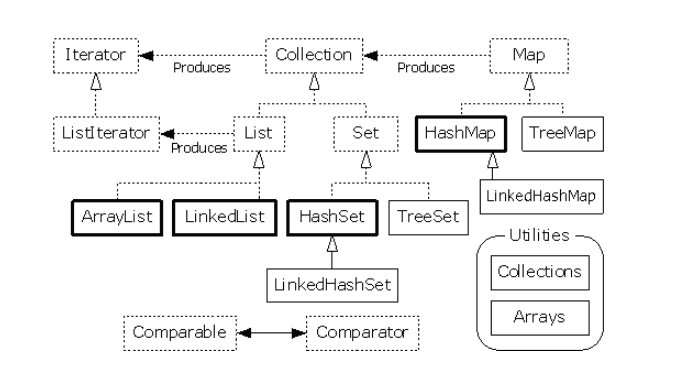
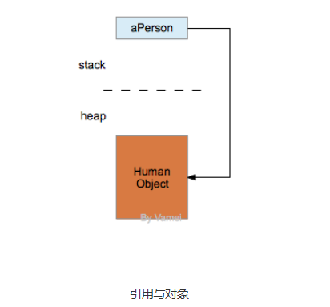
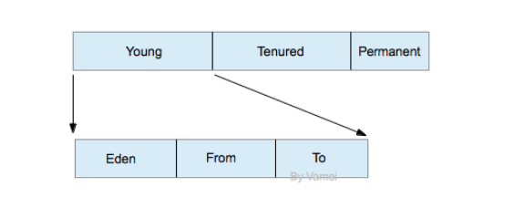

1. String 类 -字符串

    字符串是有序的字符集合

    String类包含在java.lang包中。这个包会在Java启动的时候自动import，所以可以当做一个内置类(built-in class)。我们不需要显式的使用import引入String类。

    String类对象是不可变对象(immutable object);通过创建一个新的对象来实现的，而不是对原有对象进行修改。

    String对象的特点，不变性，常量池优化和String类的final定义。

    ##### 不变性
        String对象的状态在其被创建之后就不在发生变化;在java模式中，有一种模式叫不变模式， 不变模式的作用：在一个对象被多线程共享，而且被频繁的访问时，可以省略同步和锁的时间，从而提高性能。而String的不变性，可泛化为不变模式。

    ##### 常量池优化
        当两个String对象拥有同一个值的时候，他们都只是引用了常量池中的同一个拷贝。所以当程序中某个字符串频繁出现时，这个优化技术就可以节省大幅度的内存空间了。例如：

        String s1  = "123";
        String s2  = "123";
        String s3 = new String("123"); 
        System.out.println(s1==s2); //true
        System.out.println(s1==s3);  //false
        System.out.println(s1==s3.intern());  //true

        以上代码中，s1和s2引用的是相同的地址，故而第四行打印出的结果是true;而s3虽然只
        与s1,s2相等，但是s3时通过new String(“123”)创建的，重新开辟了内存空间，因引用的
        地址不同，所以第5行打印出false;intern方法返回的是String对象在常亮池中的引用，所以最后一行打印出true。
    
    ##### final的定义
        String类以final进行了修饰，在系统中就不可能有String的子类，这一点也是出于对系统安全性的考虑。

2. 异常处理

    try, catch, finally以及随后的程序块组成。finally不是必须的

    异常处理器监视try后面的程序块。catch的括号有一个参数，代表所要捕捉的异常的类型。catch会捕捉相应的类型及其衍生类。try后面的程序块包含了针对该异常类型所要进行的操作。try所监视的程序块可能抛出不止一种类型的异常，所以一个异常处理器可以有多个catch模块。finally后面的程序块是无论是否发生异常，都要执行的程序。
    

    Java中的异常类都继承自Trowable类，一个Throwable类的对象都可以抛出(throw)

3. IO 

    在Java中，程序员往往需要多个层次的装饰(decoration)，才能实现文件读取。

    相对的复杂性带来的好处是IO的灵活性。在Java中，程序员可以控制IO的整个流程，从而设计出最好的IO方式。

        BufferedReader br = new BufferedReader(new FileReader("file.txt"));

        在创建的过程中，我们先建立了一个FileReader对象，这个对象的功能是从文件"file.txt"中读取字节(byte)流，并转换为文本流。在Java中，标准的文本编码方式为unicode。BufferedReader()接收该FileReader对象，并拓展FileReader的功能，新建出一个BufferedReader对象。该对象除了有上述的文件读取和转换的功能外，还提供了缓存读取(buffered)的功能。最后，我们通过对br对象调用readLine()方法，可以逐行的读取文件。

        (缓存读取是在内存中开辟一片区域作为缓存，该区域存放FileReader读出的文本流。当该缓存的内容被读走后(比如readLine()命令)，缓存会加载后续的文本流。)

        BufferedReader()是一个装饰器(decorator)，它接收一个原始的对象，并返回一个经过装饰的、功能更复杂的对象。修饰器的好处是，它可以用于修饰不同的对象。我们这里被修饰的是从文件中读取的文本流。其他的文本流，比如标准输入，网络传输的流等等，都可以被BufferedReader()修饰，从而实现缓存读取。

    流的读写来自于四个基类: InputStream, OutputStream, Reader和Writer。

    InputStream和Reader是处理读取操作，OutputStream和Writer是处理写入操作。它们都位于java.io包中

4. RTTI - 运行时类型识别(RTTI, Run-Time Type Identification)是Java中非常有用的机制

    多态(polymorphism)是基于RTTI实现的。RTTI的功能主要是由Class类实现的。

    Java中每个对象都有相应的Class类对象，因此，我们随时能通过Class对象知道某个对象“真正”所属的类。无论我们对引用进行怎样的类型转换，对象本身所对应的Class对象都是同一个。当我们通过某个引用调用方法时，Java总能找到正确的Class类中所定义的方法，并执行该Class类中的代码。由于Class对象的存在，Java不会因为类型的向上转换而迷失。这就是多态的原理。

        getName()         返回类的名字

        getPackage()      返回类所在的包

        newInstance() 调用默认的不含参数的构建方法。

        getFields()       返回所有的public数据成员

        getMethods()      返回所有的public方法

    ##### Class类的加载

        当Java创建某个类的对象，比如Human类对象时，Java会检查内存中是否有相应的Class对象。
        如果内存中没有相应的Class对象，那么Java会在.class文件中寻找Human类的定义，并加载Human类的Class对象。
        在Class对象加载成功后，其他Human对象的创建和相关操作都将参照该Class对象。

5. 多线程(multiple thread) - 是计算机实现多任务并行处理的一种方式

    多个线程可以并存于同一个进程空间。在JVM的一个进程空间中，一个栈(stack)代表了方法调用的次序。对于多线程来说，进程空间中需要有多个栈，以记录不同线程的调用次序。多个栈互不影响，但所有的线程将共享堆(heap)中的对象。

    继承Thread类来创建线程,run()

    实施Runnable接口，并提供run()方法;实施接口的好处是容易实现多重继承(multiple inheritance)。然而，由于内部类语法，继承Thread创建线程可以实现类似的功能。

    synchronized

6. 容器(container)

    Java中有一些对象被称为容器(container)。容器中可以包含多个对象，每个对象称为容器中的一个元素。容器是用对象封装的数据结构(data structure)。

    数组(array)

        Human[] persons = new Human[2];
        int[] a = {1, 2, 3, 7, 9};
        String[] names = {"Tom", "Jerry", "Luffy"};
    
    表(List)和集合(Set)是java.util中定义的两个接口(interface)。这两个接口都继承自Collection接口。通过实施接口，我们可以获得相应的容器。

    我们之前都是使用类(class)来说明引用的类型。事实上，我们也可以用接口(interface)来说明引用的类型。该类型引用所指向的对象必须实施了该接口。

    List - 有序的元素集合,元素可以相等

    Set - 元素没有顺序,不允许有等值的元素

    Map - 键值对的集合

        keySet()  将所有的键转换为Set
        values()  将所有的值转换为List

    
    Java中，容器的接口与实施分离。
    
    各个类与接口的关系:
    

7. 内部类 (inner class)

    Java允许我们在类的内部定义一个类。如果这个类是没有static修饰符，那么这样一个嵌套在内部的类称为内部类(inner class)。

    内部类被认为是外部对象的一个成员。在定义内部类时，我们同样有访问权限控制(public, private, protected)。

    在使用内部类时，我们要先创建外部对象。由于内部类是外部对象的一个成员，我们可以在对象的内部自由使用内部类:

    在创建内部类对象时，必须基于一个外部类对象(me)，并通过该外部类对象来创建Cup对象(me.new)

    ##### 闭包

    创建内部类对象时，必须是基于一个外部类对象。也就是说，内部类对象必须依附于某个外部类对象

    与此同时，内部类对象可以访问它所依附的外部类对象的成员(即使是private的成员)。从另一个角度来说，内部类对象附带有创建时的环境信息，也就是其他语言中的闭包(closure)特性。

8. 嵌套static类(nested static class) - 在类的内部定义static类

    可以直接创建嵌套static类的对象，而不需要依附于外部类的某个对象;相应的，嵌套static类也无法调用外部对象的方法，也无法读取或修改外部对象的数据。

        嵌套类允许我们更好的组织类
        内部类实现了闭包

9. GUI(Graphical User Interface) - 提供了图形化的界面，允许用户以图形的方式与系统进行互动

    Java的GUI功能主要集中在awt和swing两个包中。awt是GUI底层包。swing包是高层的封装，更容易移植。

    GUI的知识有助于学习移动端开发。

    ##### 事件响应(event handling) - GUI的图形元素需要增加事件响应(event handling)，才能得到一个动态的图形化界面。

10. 内存管理与垃圾回收

    Java是在JVM所虚拟出的内存环境中运行的。内存分为栈(stack)和堆(heap)两部分

    #### 栈(stack)

    在Java中，JVM中的栈记录了线程的方法调用。每个线程拥有一个栈。在某个线程的运行过程中，如果有新的方法调用，那么该线程对应的栈就会增加一个存储单元，即帧(frame)。在frame中，保存有该方法调用的参数、局部变量和返回地址。

    Java的参数和局部变量只能是基本类型的变量(比如int)，或者对象的引用(reference)。因此，在栈中，只保存有基本类型的变量和对象引用。

    引用所指向的对象保存在堆中。(引用可能为Null值，即不指向任何对象)

    

    当被调用方法运行结束时，该方法对应的帧将被删除，参数和局部变量所占据的空间也随之释放。线程回到原方法，继续执行。当所有的栈都清空时，程序也随之运行结束。

    #### 堆(heap)

    栈(stack)可以自己照顾自己。但堆必须要小心对待。堆是JVM中一块可自由分配给对象的区域。当我们谈论垃圾回收(garbage collection)时，我们主要回收堆(heap)的空间。

    Java的普通对象存活在堆中。与栈不同，堆的空间不会随着方法调用结束而清空。因此，在某个方法中创建的对象，可以在方法调用结束之后，继续存在于堆中。这带来的一个问题是，如果我们不断的创建新的对象，内存空间将最终消耗殆尽。

    #### 垃圾回收(garbage collection，简称GC) - 可以自动清空堆中不再使用的对象

    垃圾回收实际上是将原本属于程序员的责任转移给计算机。使用垃圾回收的程序需要更长的运行时间。 (比如在C/C++中，并没有垃圾回收的机制。程序员需要手动释放堆中的内存。)

    在Java中，对象是通过引用使用的。如果不再有引用指向对象，那么我们就再也无从调用或者处理该对象。这样的对象将不可到达(unreachable)。垃圾回收用于释放不可到达对象所占据的内存。这是垃圾回收的基本原则。

    (不可到达对象是死对象，是垃圾回收所要回收的垃圾)

    以栈和static数据为根(root)，从根出发，跟随所有的引用，就可以找到所有的可到达对象。也就是说，一个可到达对象，一定被根引用，或者被其他可到达对象引用。

    #### JVM实施

    JVM的垃圾回收是多种机制的混合。JVM会根据程序运行状况，自行决定采用哪种垃圾回收。

    "mark and sweep" - 这种机制下，每个对象将有标记信息，用于表示该对象是否可到达。当垃圾回收启动时，Java程序暂停运行。JVM从根出发，找到所有的可到达对象，并标记(mark)。随后，JVM需要扫描整个堆，找到剩余的对象，并清空这些对象所占据的内存。

    "copy and sweep" - 这种机制下，堆被分为两个区域。对象总存活于两个区域中的一个。当垃圾回收启动时，Java程序暂停运行。JVM从根出发，找到可到达对象，将可到达对象复制到空白区域中并紧密排列，修改由于对象移动所造成的引用地址的变化。最后，直接清空对象原先存活的整个区域，使其成为新的空白区域。

    "copy and sweep"需要更加复杂的操作，但也让对象可以紧密排列，避免"mark and sweep"中可能出现的空隙。在新建对象时，"copy and sweep"可以提供大块的连续空间。因此，如果对象都比较"长寿"，那么适用于"mark and sweep"。如果对象的"新陈代谢"比较活跃，那么适用于"copy and sweep"。

    上面两种机制是通过分代回收(generational collection)混合在一起的。每个对象记录有它的世代(generation)信息。所谓的世代，是指该对象所经历的垃圾回收的次数。世代越久远的对象，在内存中存活的时间越久。

    根据对Java程序的统计观察，世代越久的对象，越不可能被垃圾回收(富人越富，穷人越穷)。因此，当我们在垃圾回收时，要更多关注那些年轻的对象。

    

    堆分为三代。
            
        其中的永久世代(permanent generation)中存活的是Class对象。这些对象不会被垃圾回收。我们在RTTI中已经了解到，每个Class对象代表一个类，包含有类相关的数据与方法，并提供类定义的代码。每个对象在创建时，都要参照相应的Class对象。每个对象都包含有指向其对应Class对象的引用。

        年轻世代(young generation)和成熟世代(tenured generation)需要进行垃圾回收。年轻世代中的对象世代较近，而成熟世代中的对象世代较久。

    年轻世代进一步分为三个区域

        eden(伊甸): 新生对象存活于该区域。新生对象指从上次GC后新建的对象。

        from, to: 这两个区域大小相等，相当于copy and sweep中的两个区域。

        当新建对象无法放入eden区时，将出发minor collection。JVM采用copy and sweep的策略，将eden区与from区的可到达对象复制到to区。经过一次垃圾回收，eden区和from区清空，to区中则紧密的存放着存活对象。随后，from区成为新的to区， to区成为新的from区。

        如果进行minor collection的时候，发现to区放不下，则将部分对象放入成熟世代。另一方面，即使to区没有满，JVM依然会移动世代足够久远的对象到成熟世代。

        如果成熟世代放满对象，无法移入新的对象，那么将触发major collection。JVM采用mark and sweep的策略，对成熟世代进行垃圾回收。

    ** 以上是对JVM内存管理的一个概述。实际上，JVM拥有众多版本。不同版本实施的GC机制会有不小的差异。另一方面，Java本身并没有规定JVM的GC实施方式。GC依然是JVM发展的一个热点方向。我们可以预期JVM的GC机制在未来会发生许多变化。

11. Integer

        Integer a = 1000, b = 1000;
        System.out.println(a == b); //false 
        Integer c = 100, d = 100;  
        System.out.println(c == d); //true

    基本知识：如果两个引用指向同一个对象，用==表示它们是相等的。如果两个引用指向不同的对象，用==表示它们是不相等的，即使它们的内容相同。

    Integer.Java 类，有一个内部私有类，IntegerCache.java，它缓存了从-128到127之间的所有的整数对象。
    所有的小整数在内部缓存:
        
        Integer c = 100; 
    它实际上在内部做的是：

        Integer i = Integer.valueOf(100);
 
        public static Integer valueOf(int i) {
            if (i >= IntegerCache.low && i
            return IntegerCache.cache[i + (-IntegerCache.low)];
            return new Integer(i);
        }
    
    如果值的范围在-128到127之间，它就从高速缓存返回实例。

    所以…

        Integer c = 100, d = 100; 

    指向了同一个对象。